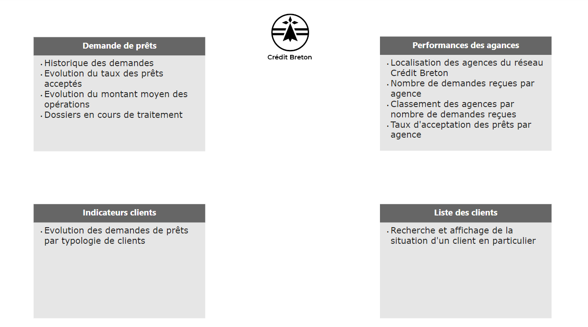
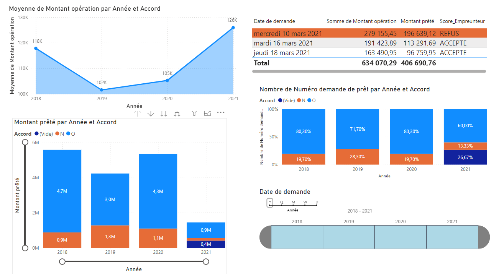
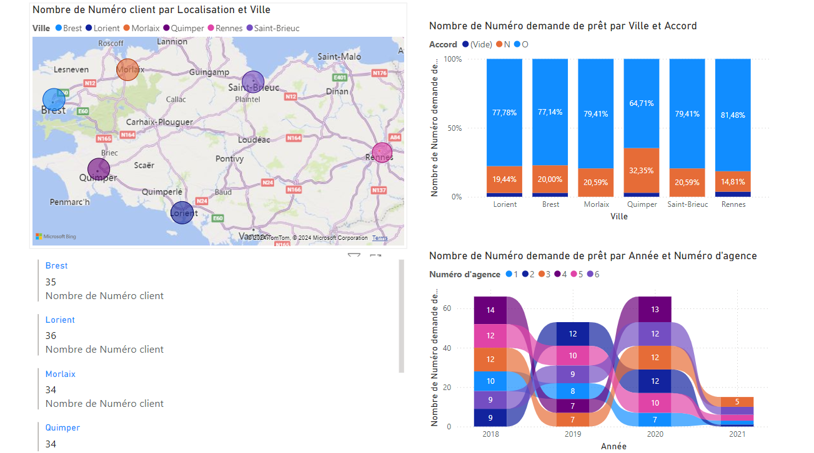
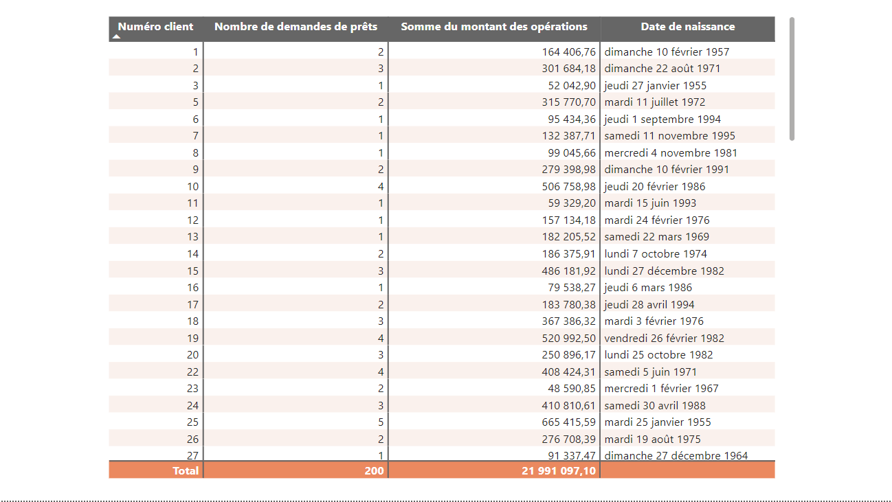
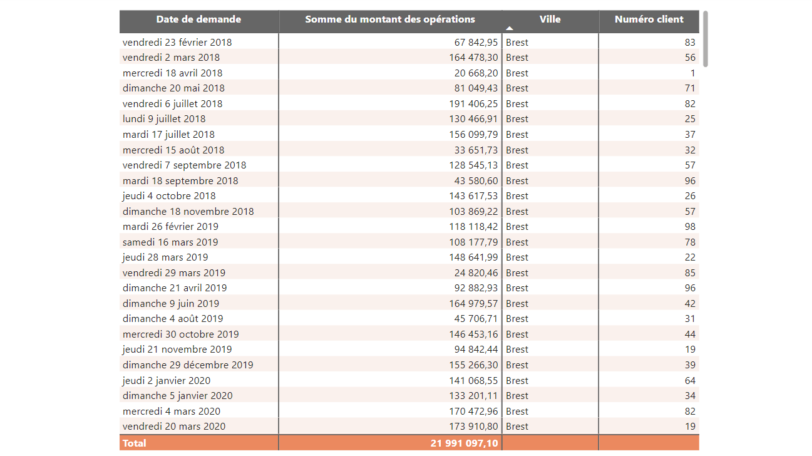

# PowerBI dashboard on Credit Breton data

Data analysis for finance involves exploring data to prepare strategic reports, and creating dashboards to facilitate decision-making.

This dashboard was created based on the OpenClassrooms course Create Dashboards with Power BI [Realisez des dashboards avec Power BI](https://openclassrooms.com/fr/courses/7110891-realisez-des-dashboards-avec-power-bi). The objective was to build a decision-support tool for granting real estate loans.

**Tools**
- Power BI

